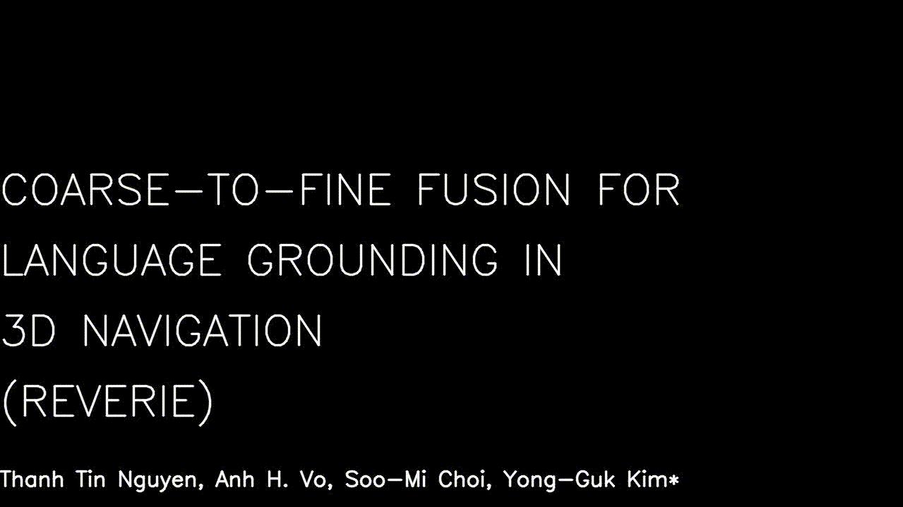
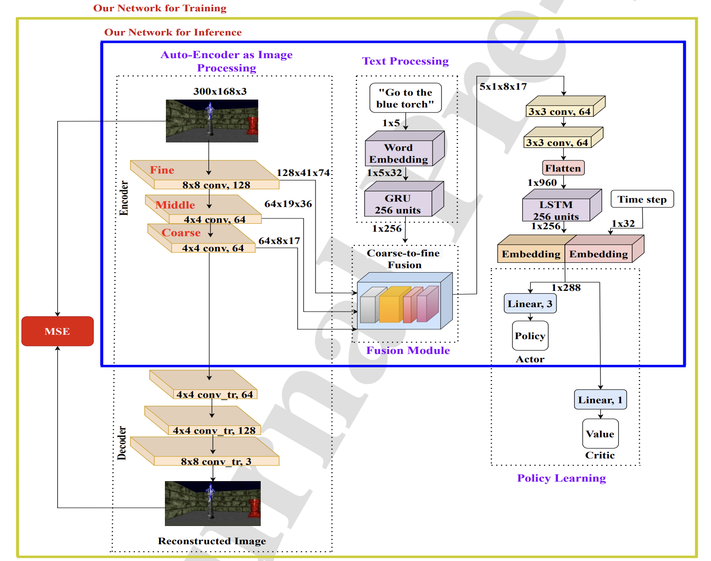

<div align="center"> 
  
# Coarse-To-Fine Fusion for Language Grounding in 3D Navigation, Knowledge-based System (2023)
by [Thanh Tin Nguyen *](https://https://ngthanhtin.github.io/), Anh H. Vo, Soo-Mi Choi, and Yong-Guk Kim. <br/>
Sejong University, Seoul, Korea <br/> 

[](https://www.sciencedirect.com/science/article/pii/S095070512300535X?via%3Dihub)
[](https://www.sciencedirect.com/journal/knowledge-based-systems) <br/>


</div> 


### Model


### This repository contains:
- Code for training an A3C-LSTM agent using Coarse-To-Fine Fusion for Language Grounding in 3D Navigation (VizDoom, REVERIE)

## Dependencies
- [ViZDoom](https://github.com/mwydmuch/ViZDoom)
- [REVERIE](https://github.com/YuankaiQi/REVERIE)
- [PyTorch](http://pytorch.org)
- OpenCV

## Usage

### Using the Environment
For running a random agent:
```
python env_test.py
```
To play in the environment:
```
python env_test.py --interactive 1
```
To change the difficulty of the environment (easy/medium/hard):
```
python env_test.py -d easy
```

### Training
Example training a Stacked Attention A3C-LSTM agent with 4 threads:
```
python a3c_main.py --num-processes 4 --evaluate 0 (1) --difficulty easy (medium, hard) --attention san (dual, gated, convolve)
```


Example training a Stacked Attention and Auto-Encoder A3C-LSTM with an agent with 4 threads:
```
python a3c_main.py --num-processes 4 --evaluate 0 (1) --difficulty easy (medium, hard) --auto-encoder --attention san (dual, gated, convolve)
```

The code will save the best model at `./saved/`.
### Testing
To test the pre-trained model for Multitask Generalization:
```
python a3c_main.py --evaluate 1 --load saved/pretrained_model
```
To test the pre-trained model for Zero-shot Task Generalization:
```
python a3c_main.py --evaluate 2 --load saved/pretrained_model
``` 
To visualize the model while testing add '--visualize 1':<br />
```
python a3c_main.py --evaluate 2 --load saved/pretrained_model --visualize 1
``` 
To test the trained model, use `--load saved/model_best` in the above commands.

## Cite as

### Bibtex:

```
@article{NGUYEN2023110785,
title = {Coarse-to-fine fusion for language grounding in 3D navigation},
journal = {Knowledge-Based Systems},
pages = {110785},
year = {2023},
issn = {0950-7051},
doi = {https://doi.org/10.1016/j.knosys.2023.110785},
url = {https://www.sciencedirect.com/science/article/pii/S095070512300535X},
author = {Thanh Tin Nguyen and Anh H. Vo and Soo-Mi Choi and Yong-Guk Kim},
keywords = {Language grounding, Vision-language navigation, Coarse-to-fine fusion, AutoEncoder, Reinforcement learning, 3D vizdoom, REVERIE},
abstract = {We present a new network whereby an agent navigates in the 3D environment to find a target object according to a language-based instruction. Such a task is challenging because the agent has to understand the instruction correctly and takes a series of actions to locate a target among others without colliding with obstacles. The essence of our proposed network consists of a coarse-to-fine fusion model to fuse language and vision and an autoencoder to encode visual information effectively. Then, an asynchronous reinforcement learning algorithm is used to coordinate detailed actions to complete the navigation task. Extensive evaluation using three different levels of the navigation task in the 3D Vizdoom environment suggests that our model outperforms the state-of-the-art. To see if the proposed network can deal with a real-world 3D environment for the navigation task, it is combined with Rec-BERT, which is based on REVERIE. The result suggests that it performs better, especially for unseen cases, and it is also useful to visualize what and when the agent pays attention to while it navigates in a complex indoor environment.}
}
```

## Acknowledgements
This repository uses ViZDoom API (https://github.com/mwydmuch/ViZDoom) and parts of the code from the API. This is a PyTorch implementation based on [this repo](https://github.com/devendrachaplot/DeepRL-Grounding).
